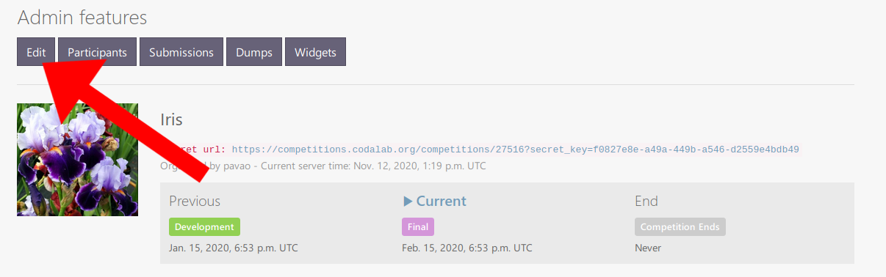
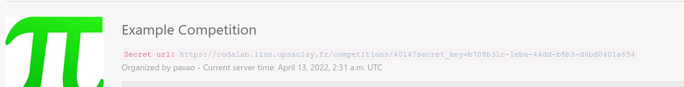
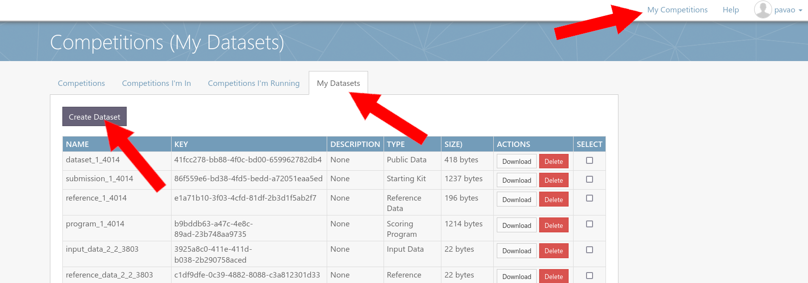
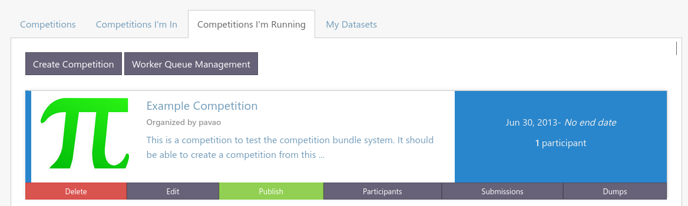

# How to organize a challenge on CodaLab Competitions

Organizing a challenge allows you to crowd-source the most difficult scientific or industrial problems in machine learning (and not limited to ML!).
As a teacher, you can use challenges as practical projects and track the results of the students in a fun way, using the leaderboard.
Even as a student, organizing a competition is an excellent way to learn data science.
This short hands-on tutorial will give you everything you need to understand how to create your first competition — as early as today!


### Why Codalab?

Codalab is **free** and **[open-source](https://github.com/codalab/codalab-competitions)**!
This means that you can deploy your own instance of the platform, or use the main deployed instance, [codalab.lisn.fr](https://codalab.lisn.fr/), and create your own challenge as early as today.
Codalab puts an emphasis on science and each year hundreds of challenges take place on it, pushing the limits in many areas: physics, medicine, computer vision, natural language processing or even machine learning itself. 
Its flexibility allows to tackle a wide variety of tasks!

Once you have an account, you can already publish your first competition! The only limit is your imagination.


### User roles

There are three (non-exclusive) types of users:

* Administrators, who manage the platform,
* **Organizers, who manage competitions,** <-- the focus of this tutorial
* Participant, who try to win the competitions.


# Step-by-step guide


### 1. Get started

* Create an account on [codalab.lisn.fr](https://codalab.lisn.fr/).

* Login to your account.

* Clone this repository to download the competition templates:

```
git clone https://github.com/codalab/competition-examples
```

_You can also use Github's web interface._


### 2. Copy and edit a competition template

The competition bundles for [CodaLab Competitions](https://github.com/codalab/codalab-competitions) can be found in the `basic-competition-bundles/` folder.

```
cd competition-examples/basic-competition-bundles/
```

Here you can find three templates:

* [Compute Pi](basic-competition-bundles/Compute_pi), a very simple competition with **code submission** where participants have to estimate the value of pi.

* [Iris Challenge](basic-competition-bundles/Iris), a simple **machine learning competition template** which features training/validation/test data, results and code submissions and multiple phases.

* [Yellow World](basic-competition-bundles/Yellow_world), a very basic template of competition with **result submission**.


#### What is a competition bundle?

A competition bundle is a ZIP file containing all the pieces of your competition: the data, the documentation, the scoring program and the configuration settings.

Let's see what we have inside the [Compute Pi](basic-competition-bundles/Compute_pi) bundle:

```
ls -1 Compute_pi/compute_pi_competition_bundle/
```

* **competition.yaml, the main file of the bundle. It contains all settings.**
* **program/**, the program used to compute the scores. You can re-write it to tackle any problem you want.
* **reference/**, the ground truth, the solution of the problem.
* **submission/**, example submissions that the participants can use (think of it as a "starting kit").
* **dataset/**, not used in this competition. It is a place-holder for a dataset.
* **utilities/**, this folder is optional and not really a part of the bundle. It just contains a script to ZIP the bundle easily.
* **logo.jpg**, the logo of the competition.
* **data.html**, all `.html` files are used to create the web pages and the documentation that will be seen by the participants. You can put any content here and as many pages as you want. You just need to refer to the pages in the `competition.yaml` setting file.
* **evaluation.html**
* **overview.html**
* **terms_and_conditions.html**


Let's edit the bundle.

* Replace `logo.jpg`

* Change title of competition in `competition.yaml`

* Make any changes you like!


### 3. Upload the competition

* ZIP the bundle:

```
cd Compute_pi/compute_pi_competition_bundle/
./utilities/make_competition_bundle.sh
```

_Warning: it is recommended to use the script to zip the bundle. If you wish to zip it by hand, be aware that every folder (e.g. scoring program, reference data, ...) needs to be zipped without directory structure, and the whole bundle needs to be zipped without directory structure._


* Upload bundle

Upload the archive you've just created into Codalab as following:

Go to “My Competitions”, then “Competitions I’m Running” and finally “Create Competition”.


Then click on "Upload Competition Bundle".


That’s it! Your competition is ready to receive submissions.


* Make sample submission

To make a submission, go to your competition, click on "Participate", then "Submit / View results", the "Submit".

Try to upload `compute_pi_sample_submission.zip`.

_Remark: if you zip the submission, make sure to include the `metadata` file. It indicates that it is a code submission._


Once your submission is processed, you can access various useful logs:


* Have a look at the leaderboard


### 4. Live edits and management of the competition

As an organizer of the competition, you have access to organizer features:

* **Edit**, an editor that you can use to change the settings of your competition at any time.
* **Participants**, to manage the participants of your competition. You can choose to allow anybody to join your competition, or to have a registration process and validate who can join.
* **Submissions**, a panel to manage all the submissions made by the participants.
* **Dumps**, a feature that you can use to download your competition as a bundle. Changes you have made using the editor will be saved.


* **Use editor**



You can use the editor to change the settings of the competition after the upload.
For example, you can add other admins of the competition that will be able to edit it using the "admins" field.

* **Share secret key**

By default, your competition is private. You can share the secret URL to allow other people to access it while it remains private.




* **Publish competition**

You can make your competition public, either from the "Competitions I'm Running" page or from the editor. This is reversible at any time.


* **Modify programs or dataset**

To edit a program (e.g. scoring program, ingestion program), or to edit the dataset, you first need to upload the new version as a zip file in the "My Datasets" page.



Once it's uploaded, you can **go to the editor** and select it in the desired field.

_Note: When uploading the program or dataset, select the right "type", or you won't be able to select it from the editor._


### 5. Cleanup. 

While following this tutorial, you may have created test competitions.
Please make them private or remove them from the platform.




# To go further

Congratulations! You know how to create a competition on Codalab! However, we barely scratched the surface of all the possibilities offered by the software. To learn more, you can refer to [CodaLab's Wiki](https://github.com/codalab/codalab-competitions/wiki). You’ll for instance learn how to link your personal compute workers (CPU, GPU) or how to define complex leaderboards with multiple criteria. You can even join the effort and develop your own features!

* [CodaLab's Wiki](https://github.com/codalab/codalab-competitions/wiki)
* [Google Group](https://groups.google.com/forum/#!forum/codalab-competitions)
* [About CodaLab](https://codalab.lisn.upsaclay.fr/highlights)


