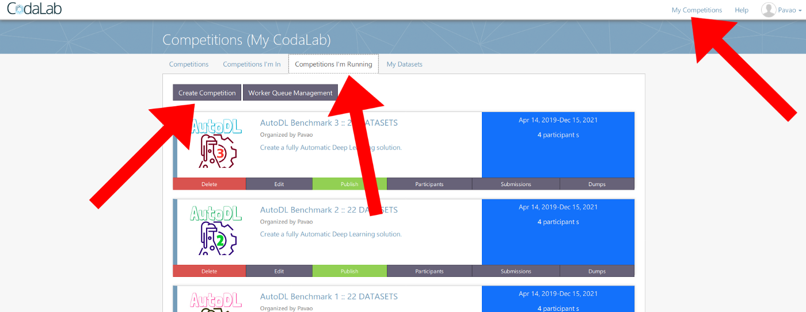
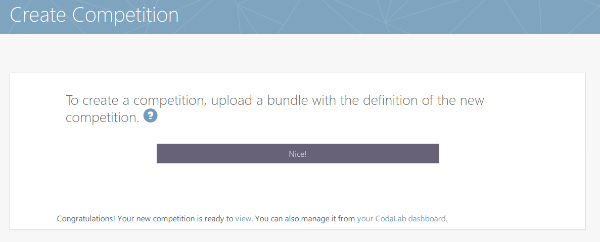
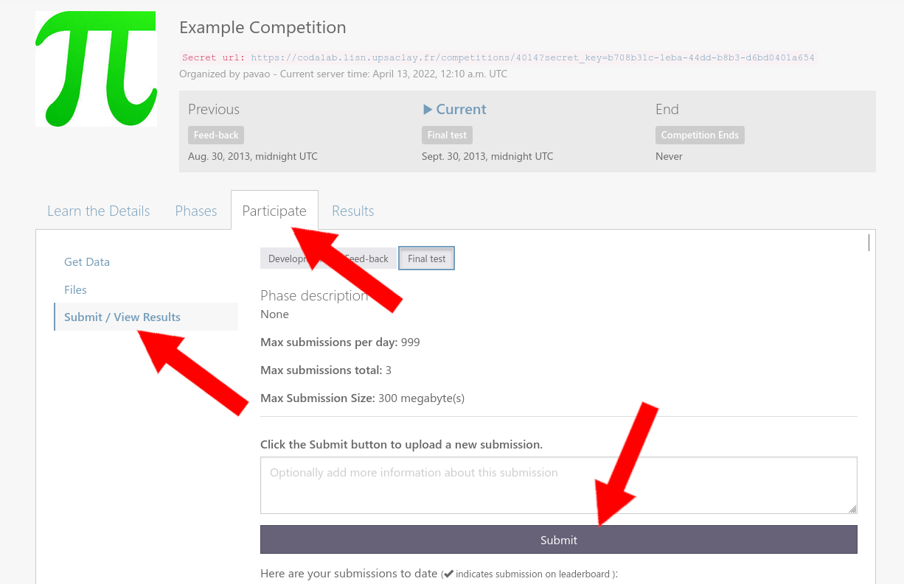
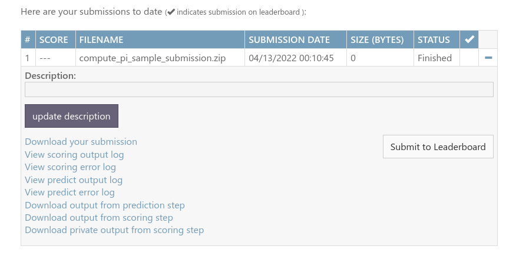
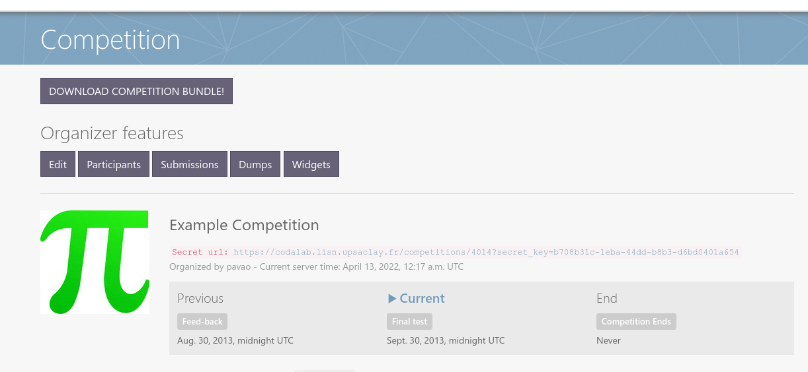

# How to organize a challenge on CodaLab Competitions

Organizing a challenge allows you to crowd-source the most difficult scientific or industrial problems in machine learning (and not limited to ML!).
As a teacher, you can use challenges as practical projects and track the results of the students in a fun way, using the leaderboard.
Even as a student, organizing a competition is an excellent way to learn data science.
This short hands-on tutorial will give you everything you need to understand how to create your first competition — as early as today!


### Why Codalab?

Codalab is **free** and [open-source](https://github.com/codalab/codalab-competitions)!
This means that you can deploy your own instance of the platform, or use the main deployed instance, [codalab.lisn.fr](https://codalab.lisn.fr/), and create your own challenge as early as today.
Codalab puts an emphasis on science and each year hundreds of challenges take place on it, pushing the limits in many areas: physics, medicine, computer vision, natural language processing or even machine learning itself. 
Its flexibility allows to tackle a wide variety of tasks!

Once you have an account, you can already publish your first competition! The only limit is your imagination.


### User roles

There are three (non-exclusive) types of users:

* Administrators, who manage the platform,
* **Organizers, who manage competitions,** <-- the focus of this tutorial
* Participant, who try to win the competitions.

_Add a scheme here._


# Step-by-step guide


### 1. Get started

* Create an account on [codalab.lisn.fr](https://codalab.lisn.fr/).

* Login to your account.

* Clone this repository to download the competition templates.

```
git clone https://github.com/codalab/competition-examples
```

_You can also use Github's web interface._


### 2. Copy and edit a competition template

The competition bundles for [CodaLab Competitions](https://github.com/codalab/codalab-competitions) can be found in the `basic-competition-bundles/` folder.

```
cd competition-examples/basic-competition-bundles/
```

Here you can find three templates:

* [Compute Pi](basic-competition-bundles/Compute_pi), a very simple competition where participants have to estimate the value of pi.

* [Iris Challenge](basic-competition-bundles/Iris), a simple **machine learning competition template** which features training/validation/test data, results and code submissions and multiple phases.

* [Yellow World](basic-competition-bundles/Yellow_world)


##### What is a competition bundle?

A competition bundle is a ZIP file containing all the pieces of your competition: the data, the documentation, the scoring program and the configuration settings.

Let's see what we have inside the [Compute Pi](basic-competition-bundles/Compute_pi) bundle:

```
ls -1 Compute_pi/compute_pi_competition_bundle/
```

* **competition.yaml, the main file of the bundle. It contains all settings.**
* **program/**, the program used to compute the scores. You can re-write it to tackle any problem you want.
* **reference/**, the ground truth, the solution of the problem.
* **submission/**, example submissions that the participants can use (think of it as a "starting kit").
* **dataset/**, not used in this competition. It is a place-holder for a dataset.
* **utilities/**, this folder is optional and not really a part of the bundle. It just contains a script to ZIP the bundle easily.
* **logo.jpg**, the logo of the competition.
* **data.html**, all `.html` files are used to create the web pages and the documentation that will be seen by the participants. You can put any content here and as many pages as you want. You just need to refer to the pages in the `competition.yaml` setting file.
* **evaluation.html**
* **overview.html**
* **terms_and_conditions.html**


Let's edit the bundle.

* Replace `logo.jpg`

* Change title of competition in `competition.yaml`

* Make any changes you like!


### 3. Upload the competition

* ZIP the bundle:

```
cd Compute_pi/compute_pi_competition_bundle/
./utilities/make_competition_bundle.sh
```

_Warning: it is recommended to use the script to zip the bundle. If you wish to zip it by hand, be aware that every folder (e.g. scoring program, reference data, ...) needs to be zipped without directory structure, and the whole bundle needs to be zipped without directory structure._


* Upload bundle

Upload the archive you've just created into Codalab as following:

Go to “My Competitions”, then “Competitions I’m Running” and finally “Create Competition”.



Then click on "Upload Competition Bundle".



That’s it! Your competition is ready to receive submissions.


* Make sample submission

To make a submission, go to your competition, click on "Participate", then "Submit / View results", the "Submit".

Try to upload `compute_pi_sample_submission.zip`.



Once your submission is processed, you can access various useful logs:




* Have a look at the leaderboard


### 4. Live edits and management of the competition



* Use editor

* Explore gray buttons

* Share secret key

* Publish competition

* Modify scoring program - change the name of the score

* Add data

* etc.


### 5. Cleanup. 

While following this tutorial, you may have created test competitions.
Please make them private or remove them from the platform.


# To go further

* [CodaLab's Wiki](https://github.com/codalab/codalab-competitions/wiki)
* [Google Group](https://groups.google.com/forum/#!forum/codalab-competitions)
* [About CodaLab](https://codalab.lisn.upsaclay.fr/highlights)


